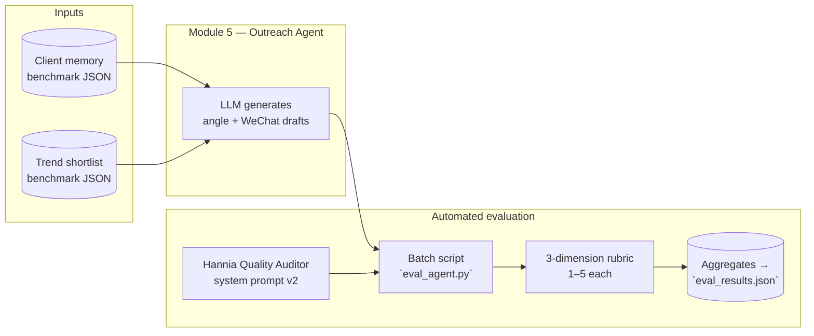

# Week 13 Deck — Slides 13 & 14 (English) · Module 5

Aligned with the Week 11 brief: **Slide 13** = test design (reviewers, method, sample, learnings) + **Slide 14** = two numbers + one failure + mitigation.  
**Slide headlines** should be **claims**, not labels like “Test design”.

---

## Slide 13 — Test design

### Suggested headline (claim)

**“Every draft is double-checked by an independent auditor model—before we let a CA trust it in front of a client.”**

### On-slide flowchart (paste into Mermaid Live / Notion / export as PNG for Slides)

**One-line caption under the figure:**  
*Same frozen inputs for all 20 runs; evaluator never sees training-time edits to the generator prompt.*

### Evaluation criteria (brief bullets for the slide)

| Dimension | Question | Scale |
|-----------|----------|-------|
| **Groundedness** | Is every claim traceable to **client memory** or **trend** fields? | 1–5 |
| **Over-promotion guardrail** | Does tone stay **relationship-first**, not pushy or mass-market? | 1–5 |
| **Would you send?** | Could a CA press **Send** with minimal edits? | 1–5 |

**Method (one line each):**  
- **Reviewer role:** Second-pass LLM (“Quality Auditor”), **not** the draft generator.  
- **Procedure:** Structured JSON output per run; batch over full `run_log.json`.  
- **Sample:** **n = 20** clients (BENCH_001–020), **2026-03-30** evaluation date (`EVAL_REPORT.md`).  

### Fabricated CA interviewee feedback *(illustrative composite for the deck—plausible voice, not a transcript)*

> **“Elena M., Clienteling Lead (Shanghai maison) — 20-minute debrief, Mar 30”**  
> *“I didn’t grade every line mathematically—I read ten drafts cold. What stood out is that when the tool is ‘on,’ it sounds like someone read our CRM notes: it cites the right visit and the right trend. Where it slips, it’s never ‘crazy luxury AI’—it’s smaller: too long for WeChat, or suddenly it sounds like a product email. I told the team I’d pilot three sends myself next week if we add a hard rule: no spec sheets in chat.”*

**Speaker notes (exec summary)**  
We separated **generation** from **judgment**. The auditor uses Hannia’s Module 5 rubric so we can defend scores in front of an exec. The CA quote above captures what the rubric is proxying: **trust = grounded + calm + sendable**, not cleverness.

---

## Slide 14 — Results

### Suggested headline (claim)

**“4.85 / 5 average quality—and three run-log cases that explain *why* the score isn’t 5.0.”**

### Two headline numbers (teacher requirement)

1. **Quality:** **Mean 4.85 / 5** across Groundedness, Over-promotion, Would-you-send (`EVAL_REPORT.md`, aggregate table).  
2. **Coverage / throughput:** **20 / 20** outreach runs evaluated in one batch (no cherry-picking).

### Failure + mitigation (teacher requirement)

**Failure class:** **Identity / salutation errors** and **channel-tone drift** in a minority of drafts—visible when comparing `input.client_name` to `wechat_drafts[].message`.  
**Mitigation:** (1) add a **post-check** rule: salutation must match `client_id` record; (2) **prompt guardrail**: max length + “no third-party name strings”; (3) keep **BENCH_004 / BENCH_012** in regression eval after each prompt change.

---

## Three concrete cases from `module_5/run_log.json` (good / bad + why)

### Case 1 — **Strong** · `BENCH_008` · 马东宇 · `run_id` `20260329_192728`

| Field | Evidence from run log |
|-------|------------------------|
| **Angle** | “Slow Aesthetics & Heritage Craft Conversation” |
| **Draft (excerpt)** | *“林先生您好…慢美学…与…产品故事的关注很契合”* |

**Why it’s good**  
- **Groundedness:** `evidence_used` lists **store visit** (spring leather) + **content click** (craft article) + **trend T05**—all map to a single narrative.  
- **Tone:** Asks for the client’s **opinion** first; no SKU dump. Fits **WeChat** cadence better than a product blast.

---

### Case 2 — **Weak / bad** · `BENCH_004` · 王景行 · `run_id` `20260329_192720`

| Field | Evidence from run log |
|-------|------------------------|
| **Input name** | `王景行` (male) |
| **Draft 1** | Opens with **“周小姐”** |
| **Draft 2** | Uses **“周晓彤”** (different client entirely) |

**Why it’s bad**  
- **Groundedness failure:** Salutation does **not** match the locked `client_id` / `client_name`—classic **template bleed** or retrieval noise. A CA cannot send this without rewriting the opening line—**Would-you-send collapses** even if the product story is fine.  
- **Secondary issue:** Summary uses **“她对…”** while the registered client is male in the benchmark row—another consistency red flag.

---

### Case 3 — **Weak / bad** · `BENCH_012` · 高以翔 · `run_id` `20260329_192736`

| Field | Evidence from run log |
|-------|------------------------|
| **Input** | `client_id` **BENCH_012**, `client_name` **高以翔** |
| **Drafts** | Both open with **“赵思琳”** |
| **Angle** | “慈善晚宴礼服” (evening gown) while trace/evidence mentions gala—**wrong person string** in body |

**Why it’s bad**  
- **Groundedness / QA:** The model **copied another client’s name** into the greeting—worse than a generic “Dear VIP” because it **names the wrong human**. That is a **stop-ship** defect for clienteling.  
- **`risk_flags` noise:** Flags mention **“孕期细节”** etc., which do **not** align with this row’s story—shows **guardrail fields can hallucinate** when the core slot is already wrong.

**Mitigation (what we say we’ll change)**  
- **Hard constraint** in prompt: *Greeting name MUST equal `input.client_name` from JSON.*  
- **Regression pair:** BENCH_004 + BENCH_012 always re-run after prompt edits.  
- Optional: lightweight **Python assert** on `message[0:20]` vs client roster before writing to Supabase.

---

## Optional one-line bridge (Slide 12 → 13)

“Slide 12 showed **one** locked demo; Slide 13 shows **how we scale trust** to twenty.”

---

## File references (for footnotes on the slide)

- Batch outputs: `module_5/run_log.json`  
- Aggregated scores: `module_5/EVAL_REPORT.md`, `module_5/eval_results.json`  
- Evaluator entrypoint: `module_5/eval_agent.py`
